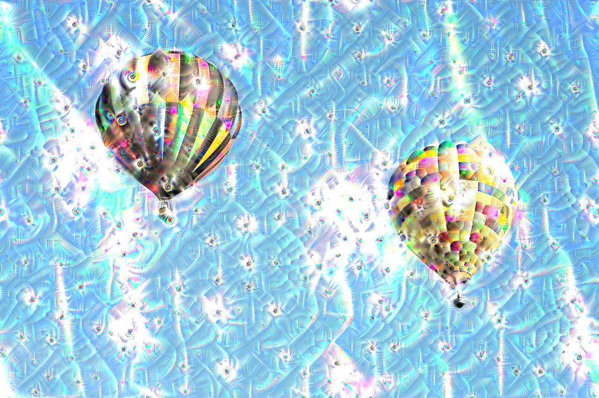
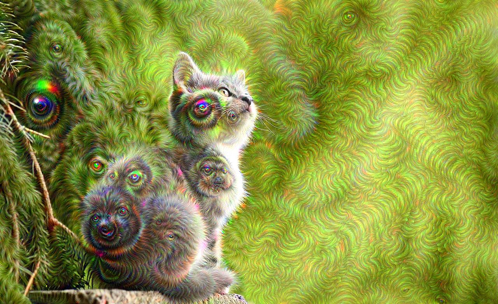
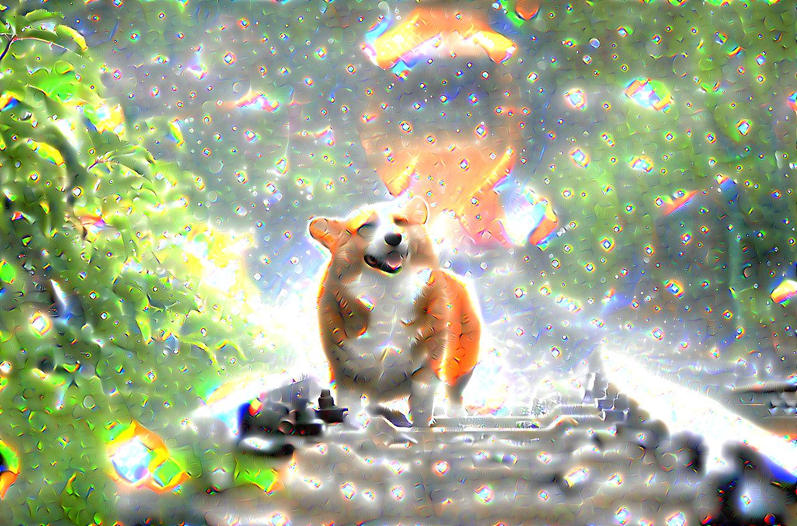
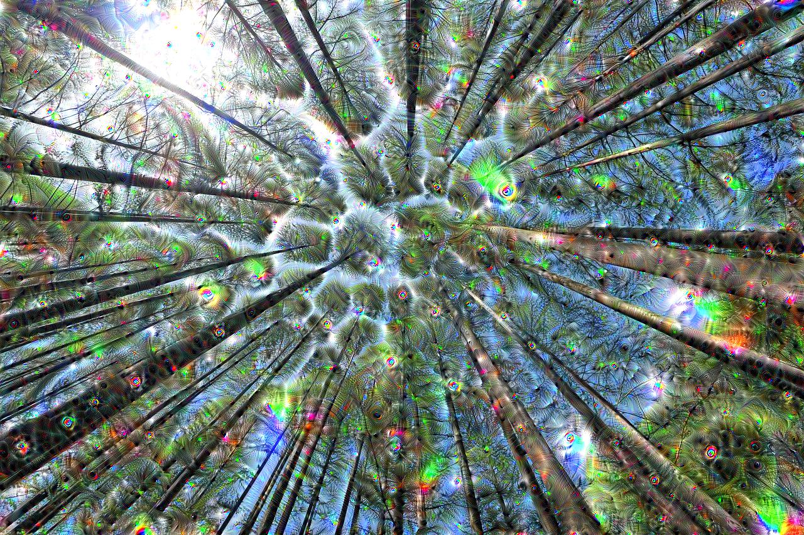

# ConvNet - Deep Dream
_Using PyTorch for deep dreaming_

---

## About

The aim of this project is to create some fun images and to help me improve in using the PyTorch library for machine learning tasks. Apart from that, I just like using convolutional neural networks in a creative manner.

## Usage

In order to use the Deep-Dream Python script like any other CLI application, the following parameters can be specified ... 

| Argument            | Explanation                                                | Required? | Default |
|---------------------|------------------------------------------------------------|-----------|---------|
| -h, --help          | Displays the help message                                  | ❌         | -       |
|                     |                                                            |           |         |
| -b, --base-img      | Specifies the path to the base image                       | ✔️         | -       |
| -d, --destination   | Specifies the destination of the resulting image           | ❌         | -       |
| -n, --n-octaves     | Defines the number of octaves used for the dream           | ❌         | 10      |
| -s, --octave-scales | Defines the factor by which each octave should be scaled   | ❌         | 1.4     |
|                     |                                                            |           |         |
| --lr                | Defines the learning rate / step size                      | ❌         | 0.01    |
| --iters             | Specifies the number of iterations per partial dream       | ❌         | 10      |
| --layer-n           | Defines the layer, whose activations should be maximized   | ❌         | 10      |
|                     |                                                            |           |         |
| -v, --verbose       | Flag; Should intermediate results be displayed?            | ❌         | False   |
| -i, --interval      | Specifies the interval for displaying intermediate results | ❌         | 5       |

## Results

Here are some of the final results: ...

| Original                              | @conv3(layer=4)                           | @inception3b(layer=7)                     | @inception4b(layer=10)                    | @maxpool4(layer=14)                       |
|---------------------------------------|-------------------------------------------|-------------------------------------------|-------------------------------------------|-------------------------------------------|
|  |  |  |  |  |
|            |       |       |       |       |
|        |     |     |     |     |
|            |       |       |       |       |
|        |     |     |     |     |
|  |  |  |  |  |
|      |    |    |    |    |
|        |     |     |     |     |

_Various dreams with different depths_

## Conclusion

I'm very glad about the end results. This was a slighter smaller project than usual, as there wasn't a lot of code to write and I finished quite quickly. However, I still appreciate me being able to learn new stuff about convolutional neural networks and different ways to visualize what their doing.

**P.S.:** I might add some new features to this project every now and then (whenever I have some spare time on my hands), as there are still some things that could be implemented: Guided Deep Dreams, etc.

## References

- [Original Google Deep-Dream repository](https://github.com/google/deepdream)
- [Different PyTorch Deep-Dream implementation](https://github.com/eriklindernoren/PyTorch-Deep-Dream)
- [Pictures from Pixabay](https://pixabay.com)

---

... MattMoony (September, 2019)